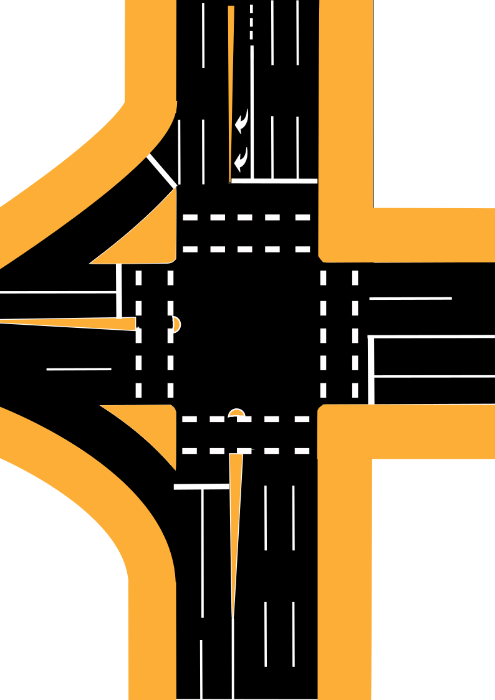
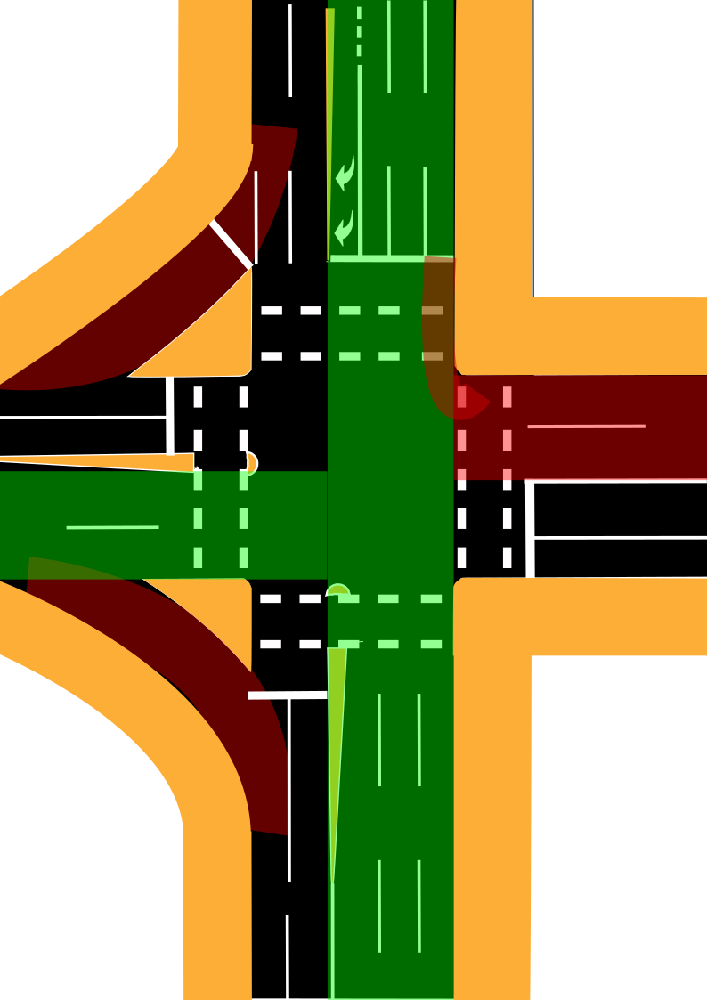
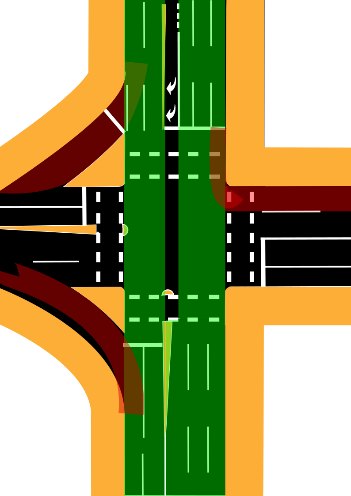

Moving throughout Brisbane as a pedestrian you are constantly reminded of the blatent prioritisation of motor vehicles over all other forms of travel, especially those walking.

You mostly feel this prioritisation at conflict points where the paths of motor vehicles and pedestrians cross at intersections. More often than not, when a traffic engineer has to balance the scale of a green time of a pedestrian or the amount of time a motor vehicle gets to turn left into their path, the traffic engineer tips the scale in favour of the motor vehicle. 

A prime example of this experience can be found at the intersection of Gregory Terrace and Brunswick Street (Abbortsford Road on one side of the intersection). Pictured in the banner above, however a simplied version of the intersection is pictured below:

It's a large interection, however it has quite a simple light cycle due to the turning restrictions (only right turns are allowed coming from Abbortford Road into Gregory Terrace) and the two slip lanes reducing conflict points - the light cycle only has three phases.

To simplify the descriptions for the phases I'll be using the following shorthand:
1.  the Street origin of the vehicle (what street it's on when approaching the intersection):
- Abbortford Road (AR)
- Gregory Terrace (GT)
- Brunswick Street (BS)
2. origin position (based on the drawing above):
- Top (T)
- Bottom (B)
- Left (L)
- Right (R)
3. the direction headed from the perspect of the driver:
- Straight (S)
- Turning Left (L)
- Turning Right (R)

This will be displayed in square brackets in the above order separated by commas. If there is a conflict with Pedestrians, an exclamation mark will be used after the array. If it's a sliplane the array will start with a dolalr sign ($). For example, to describe a vehicle on Abbortsford Road originating at the top of the diagram Turning Right into Gregory Terrace with no conflict with pedestrians, this would be described as [AR, T, R].

The observed light cycles for the motor vehicle traffic lights are described below:

| 
Phase No
| 
Time (s)
 | 
Who's Green?
 | Diagram
|----|----|----|---|
| Phase 1| 20s | [AR, T, S] [AR, T, R] [AR, T, L]! $[BS, B, L]! $[GT, L, L]! |  |
| Phase 2| 50s | [AR, T, S] [AR, T, L]! [BS, B, S]  $[BS, B, L]! $[GT, L, L]! |  |
| Phase 3| 20s | [GT, L, S] [GT, R, S] [GT, R , L]!  $[BS, B, L]! $[GT, L, L]!|  |

**Note**: For completeness, if no vehicle is detected wanting to turn right from Abbortford Road into Gregory Terrace, Phase 1 does not occur and its time is absorbed into Phase 2 (totalling 70 seconds instead of 50).

With all that preamble out of the way, what does this have to do with the pedestrian experience?

Well, let's take a look at how long pedestrians are given to cross the street during each phase:

| 
Phase No
 | Who can cross and for how long? | 
|----|----|
| Phase 1| - Crossing Gregory Terrace using the Ped Crossing on the Right Side of Diagram - 5s Green + 15s Flashing Red|
| Phase 2| - Crossing Gregory Terrace using the Ped Crossing on the Left Side of Diagram - 5s Green + 15s Flashing Red|
| Phase 3| - Crossing Abbortsford Road using the Ped Crossing on the Top Side of Diagram - 5s Green + 15s Flashing Red   -Crossing Brunswick Street using the Ped Crossing on the Bottom Side of Diagram - 5s Green + 15s Flashing Red|

**Notes**: 
- Again for completeness, if no vehicle is detected wanting to turn right from Abbortford Road into Gregory Terrace, Phase 1 does not occur but the time allocated for pedestrians to cross is moved into Phase 2.
- The pedestrian crossing times start at the start of its phase. If the pedestrian request to cross button is not pressed before the phase, no green light will be given and the pedestrian must wait for the next time the phase comes along (maximum 1 minute 30 seconds). 

You might make the following observations:

- Wow, isn't it a coincidence that all of the pedestrian crossing times are the same 5 green + 15 flashing red no matter what the light cycle? Was any thought put into these figures or is it some default value?
- Wait, in Phase 2, there are no conflicts between pedestrians crossing on the left side of the diagram and motor vehicles, why can't pedestrians cross for the entirety of that phase? 
- In Phase 2, pedestrians can only cross a total of 20 seconds (only 5 seconds to begin crossing) out of the 50 seconds allocated to the phase

Combine these with the following facts:
- At a signalised crossing, pedestrians may only start begin crossing the intersection if there is a green walk signal. Pedestrians may complete the crossing during the flashing red walk signal phase but must not begin crossing.
- Jaywalking is illegal in Queensland and you can be fined $53.00 for non-compliance. 
- Vehicles do not have to take into account the pedestrian walk signals, if they have a green light, they can turn and cross over a pedestrian crossing provided that they give way to all pedestrians crossing. 

You might make the following additional (possibly more aggrevating) observations:
- The total amount of time given to pedestrians to begin walking is 10 seconds out of the full 90! That's assuming the buttons were already pressed in time. 
- If you were a random pedestrian, approaching the intersection at a random time, at least 88% you are not allowed to start crossing in any direction. 
- If (like most people) you have a specific direction you want to go in, the chances if you cataching a green walk signal on approach in 5/90 seconds or about 5.6%! 

Travelling as a pedestrian at this intersection sucks! I really wonder why there are so many cars instead of here?

Now look, you might disagree with my assessment here and I want to express that is totally fine. 

However, as someone who has to interact with this intersection on nearly a daily basis, I get the sense from the traffic engineers who implemented these traffic lights that:

- They want to maximise the number of vehicles travelling through at any and all expense.
- They do not consider the pedestrian throughput or any experience that might increase the number of pedestrians choosing to cross here by foot or instead of by car as a valuable metric to base their decisions on.
- There is some minimum required crossing time that they had to give pedestrians to cross a street of there size and I would wager that 5 seconds green and 15 seconds flashing red is that minimum.

The reason I have sadly come to these conclusions came when  I alerted Brisbane City Council about the situation in phase two, where a pedestrian is crossing Gregory Terrace on the left side of the diagram and would have no conflict whatsoever with motor vehicles yet cannot cross for the entirety of that phase. After some back and forth, they ultimately gave the reason that they could not increase the timing of the pedestrian crossing because would encourage pedestrians to dangerously cross the slip lanes on either side in order to catch the green light.

This is reasoning is baffling to me for the following reasons:
1. How would increasing the green walk suddenly make people cross the  slip lanes more often? People are going to cross the slip lanes regardless of what the walk signal says so they can press the beg button to cross. If anything, you would think pedestrians would be less in a rush to cross the slip lane knowing that the walk signal is longer. 
2. In slip lanes, motorists must always give way to pedestrians. If they  believe that the slip lanes are so dangerous that pedestrians should not feel comfortable to legally cross at any time, reducing the crossing time is a really stupid way of addressing that problem. How about a wombat crossing, or a zebra crossing, law enforcement, or even a f**king sign that says give way to pedestrians would all be better solutions for pedestrian safety - but we know that's not actually their goal.

