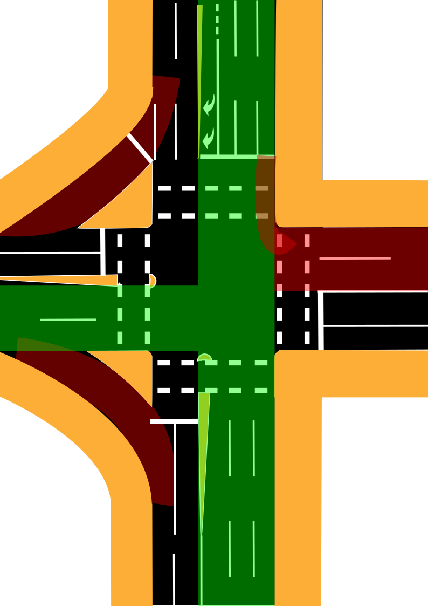
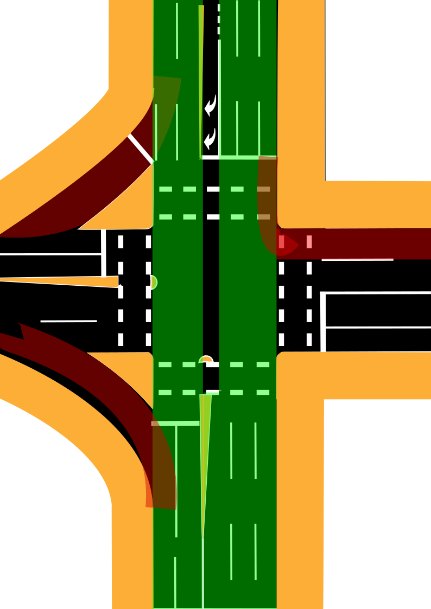
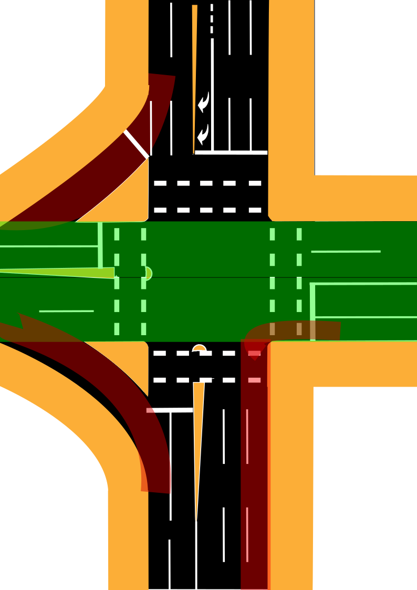

Moving throughout Brisbane as a pedestrian, you are constantly reminded of the blatant prioritisation of motor vehicles over all other forms of travel, especially those walking.

You mostly feel this prioritisation at conflict points where the paths of motor vehicles and pedestrians cross at intersections. More often than not, when a traffic engineer has to balance the scale of a green time of a pedestrian or the amount of time a motor vehicle gets to turn left into their path, the traffic engineer tips the scale in favour of the motor vehicle.

A prime example of this experience can be found at the intersection of Gregory Terrace and Brunswick Street (Bowen Bridge Road on one side of the intersection). Pictured in the banner above, however a simplified version of the intersection is pictured below:

It's a large intersection; however, it has quite a simple light cycle due to the turning restrictions (only right turns are allowed coming from Bowen Bridge Road into Gregory Terrace) and the two slip lanes reducing conflict points—the light cycle only has three phases.

To simplify the descriptions for the phases, I'll be using the following shorthand:
1. The street origin of the vehicle (what street it's on when approaching the intersection):
   - Bowen Bridge Road (BBR)
   - Gregory Terrace (GT)
   - Brunswick Street (BS)
2. Origin position (based on the drawing above):
   - Top (T)
   - Bottom (B)
   - Left (L)
   - Right (R)
3. The direction headed from the perspective of the driver:
   - Straight (S)
   - Turning Left (L)
   - Turning Right (R)

This will be displayed in square brackets in the above order separated by a comma. If there is a conflict with pedestrians, an exclamation mark will be used after the array. If it's a slip lane, the array will start with a dollar sign ($). For example, to describe a vehicle on Bowen Bridge Road originating at the top of the diagram turning right into Gregory Terrace with no conflict with pedestrians, this would be described as [BBR, T, R].

### Observed Light Cycles for Motor Vehicles

| 
Phase No
| 
Time (s)
 | 
Who's Green?
 | Diagram (Green = no conflict with peds, Red = conflict) |
|----|----|----|----|
| Phase 1 | 20s | [BBR, T, S] [BBR, T, R] [BBR, T, L]! $[BS, B, L]! $[GT, L, L]! |  |
| Phase 2 | 50s | [BBR, T, S] [BBR, T, L]! [BS, B, S]  $[BS, B, L]! $[GT, L, L]! |  |
| Phase 3 | 20s | [GT, L, S] [GT, R, S] [GT, R , L]!  $[BS, B, L]! $[GT, L, L]!|  |

**Note**: If no vehicle is detected wanting to turn right from Bowen Bridge Road into Gregory Terrace, Phase 1 does not occur, and its time is absorbed into Phase 2 (totalling 70 seconds instead of 50).

### Pedestrian Experience at the Intersection

| 
Phase No
 | Who can cross and for how long? |
|----|----|
| Phase 1 | - Crossing Gregory Terrace using the Ped Crossing on the Right Side of Diagram - 5s Green + 15s Flashing Red|
| Phase 2 | - Crossing Gregory Terrace using the Ped Crossing on the Left Side of Diagram - 5s Green + 15s Flashing Red| 
| Phase 3 | - Crossing Bowen Bridge Road using the Ped Crossing on the Top Side of Diagram - 5s Green + 15s Flashing Red   - Crossing Brunswick Street using the Ped Crossing on the Bottom Side of Diagram - 5s Green + 15s Flashing Red|

### Key Observations

- The total amount of time given to pedestrians to begin walking is **10 seconds out of the full 90**.
- If a pedestrian approaches the intersection at a random time, at least **88% of the time, they are not allowed to start crossing in any direction**.
- The chances of catching a green walk signal upon arrival are **5.6%**.

### Council's Response

When I alerted Brisbane City Council about the issue where a pedestrian crossing Gregory Terrace on the left side of the diagram has **no conflict with vehicles but cannot cross for the entirety of that phase**, their justification was that extending the pedestrian green time would encourage pedestrians to dangerously cross the slip lanes.

This reasoning is baffling:
1. People **already** cross the slip lanes to press the beg button; extending the green walk signal wouldn’t change this behavior.
2. If the slip lanes are so dangerous, instead of reducing pedestrian crossing time, better solutions would be **zebra crossings, wombat crossings, better enforcement, or even just proper signage**.

### Suggested Improvements

1. **Synchronize pedestrian signals with traffic signals where there is no conflict.** The western pedestrian crossing should match the northbound traffic on Brunswick Street to Bowen Bridge Road.
2. **Increase pedestrian crossing time where left-turning vehicles must give way.** The eastern pedestrian crossing should align with southbound traffic from Bowen Bridge Road to Brunswick Street, allowing more time for pedestrians while ensuring a short period for left-turning vehicles.
3. **Automate all pedestrian signals.** Pedestrians shouldn’t have to press a button to cross legally; vehicles **must** give way anyway, so this change would have minimal impact on traffic while greatly improving pedestrian convenience.

Brisbane City Council has the power to make these improvements but chooses not to. For now, pedestrians at this intersection remain an afterthought.
